[](https://classroom.github.com/a/YyUO0xtt)
# COMP2150  - Level Design Document
### Name: [Gian-Luca Battaglia]
### Student number: [47416084] 

```
```
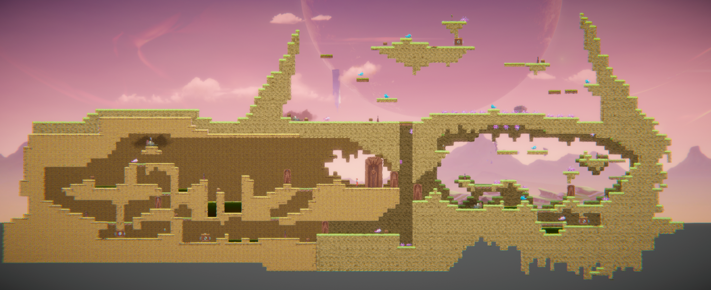

## 1. Player Experience (~700 words)

### 1.1. Discovery
Players learn the games mechanics and dynamics through isolation, repetition and reinforcement mechanics through confined spaces that direct player interactions, repetition of actions and reinforcement through a risk / reward system. Upon starting the game players spawn in a confined room with limited options for movement, leading them to interact with the environment and interact/discover Pass-Through-Platforms & a new checkpoint. Players now encounter basic jumps over acid, activate pressure plates with moveable cubes to unlock the previously confined rooms & navigate increasingly challenging jumps varying in size and shape. As a reward players are given a checkpoint after the harder jumps & just before their first encounter with enemy & there first weapon. This approach allows for players to experiment and make there own discoveries slowly introducing the basics of each mechanics & dynamics in a controlled space before progressing to later sections with high difficulty.

 The encounter & level design encourages players to interact with their environment, rewarding them when completing a task successfully and not punishing them for failure but allowing them to reattempt difficult sections without losing excessive progression.

 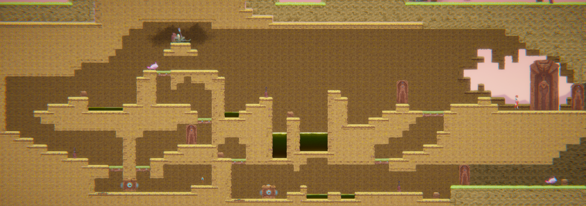

### 1.2. Drama
The intensity curve in the level design starts with section one, which is intentionally easier to allow players to familiarize themselves with the mechanics and challenges. Even here, players encounter tense moments like facing the first enemy and navigating hazardous acid traps with precise timing. These tense moments are balanced by periods of relief, providing players with a chance to catch their breath and process what they've learned.

As players progress to section 2, the intensity ramps up significantly through new hazards are introduced, including spikes, new enemies, and moving platforms, making jumps trickier and more time-sensitive. Safe zones become scarcer, and checkpoints are spaced further apart, heightening the overall challenge. This design facilitates increasing yet modulating intensity by gradually introducing new challenges and building upon existing ones. Each section is divided into encounters that require players to utilize their skills, ensuring they have a clear goal to work towards. 

### 1.3. Challenge
The main challenges in the game are the enemies and traps/hazards, as players have limited health and cannot constantly engage in fights or rush through traps. Many jumps require precision and are time-sensitive, especially in section 2. To control the difficulty curve and keep players in the flow channel, I've designed the game to gradually introduce mechanics and dynamics in section 1, allowing players to build confidence in their skills. As the challenge increases, players enter section 2, where they encounter over double the previous enemies in open spaces with more punishing jumps, often on moving platforms. To prevent discouragement, I replaced the acid traps from section 1 with spike traps. While still dangerous, spike traps allow players a brief moment to recover after taking damage, making the section challenging yet player-friendly.

### 1.4. Exploration
The level's sections operate autonomously together, while each offering a unique experience setting it apart from the rest. Section 2 contrasts this, with vibrant colours that challenge players' focus on key elements like moving platforms and traps, the stark difference from section 1's confinement and lack of freedom amplifies the impact of the environment, enhancing the player's experience within section 2 whilst also creating a new challenge.  

#### Layout & Pathing
The sections are interconnected by a moving platform acting as an elevator, allowing non-linear pathing between sections once section 1 is completed, this form of non-linear pathing is continued in parts of sections 2 and 3, offering multiple paths for progression.


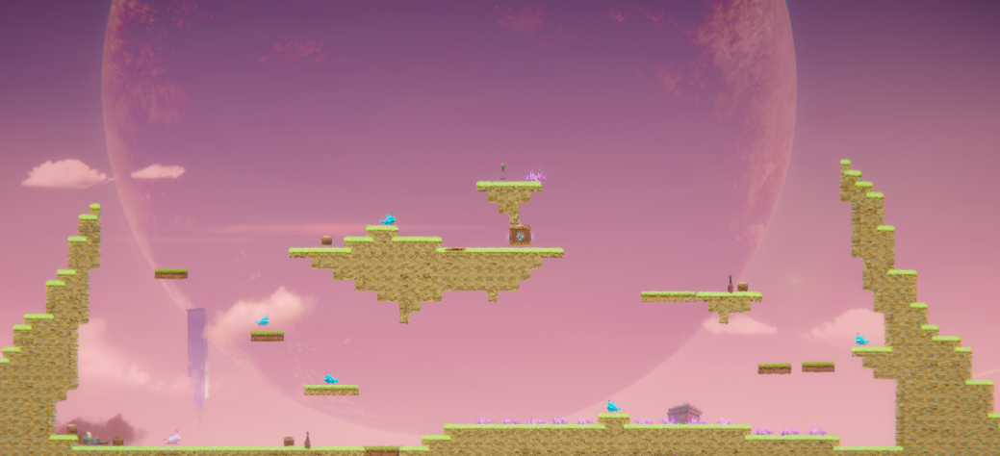

#### Aesthic
The aesthetic of each section is distinct: section 1 is underground with cave-like spaces and desert surroundings, section 2 features an open sky with lush grass and vivid colours, and section 3 blends underground jungle elements with visible skylights and natural stone formations. These unique aesthetics facilitate exploration without hindering navigation, making it easy for players to orient themselves within the level.

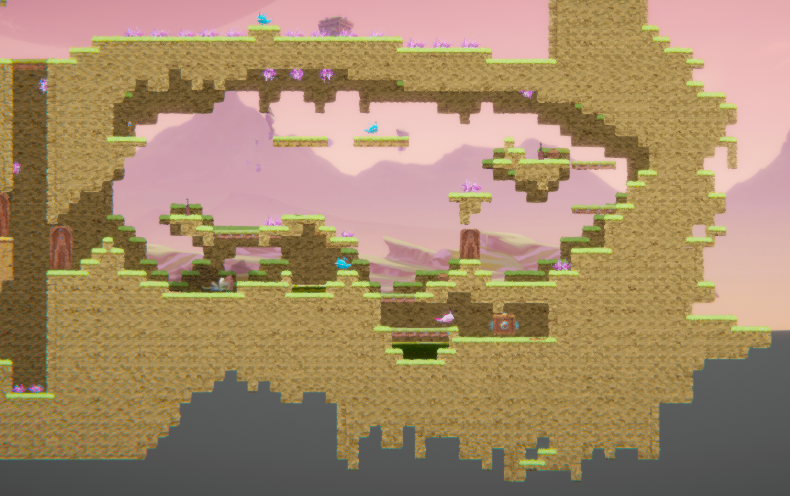

## 2. Core Gameplay (~400 words)
A section on Core Gameplay, where storyboards are used to outline how you introduce the player to each of the required gameplay elements in the first section of the game. Storyboards should follow the format provided in lectures.

### 2.1. Passthrough Platforms
PassThrough platforms are tiles that are not snapped to the grid board and are treated as an object, by crouch down and pressing space players can drop down through passthrough platforms.
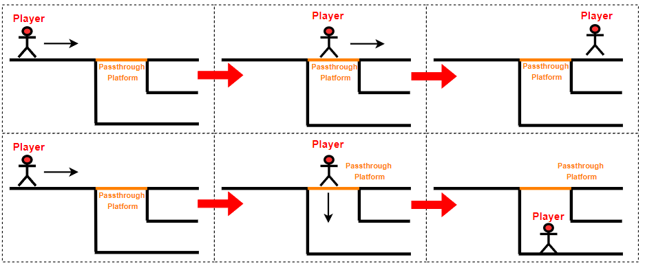

### 2.2. Checkpoints
A checkpoint is strategically placed at the beginning of each area in level this sets the players spawn to a set location everytime they reach a certain area, if the player has yet to touch a new checkpoint and dies on the way they will respawn at the previous checkpoint and if they haven't touched any will respawn at the original spawn point.
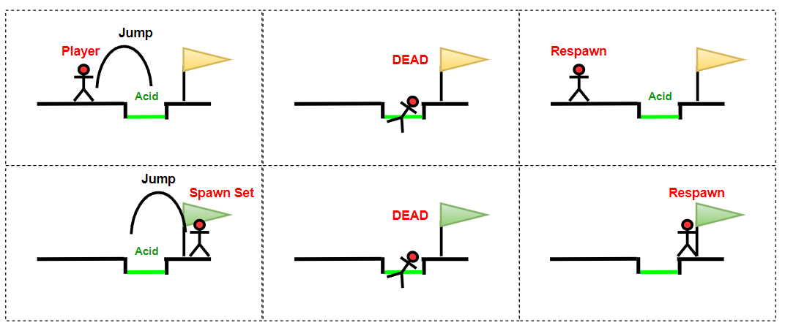

### 2.3. Acid
Acid is a trap object that can be placed similar to tiles, when players come into contact with acid they take 1 damage and are reset back to the last checkpoint.
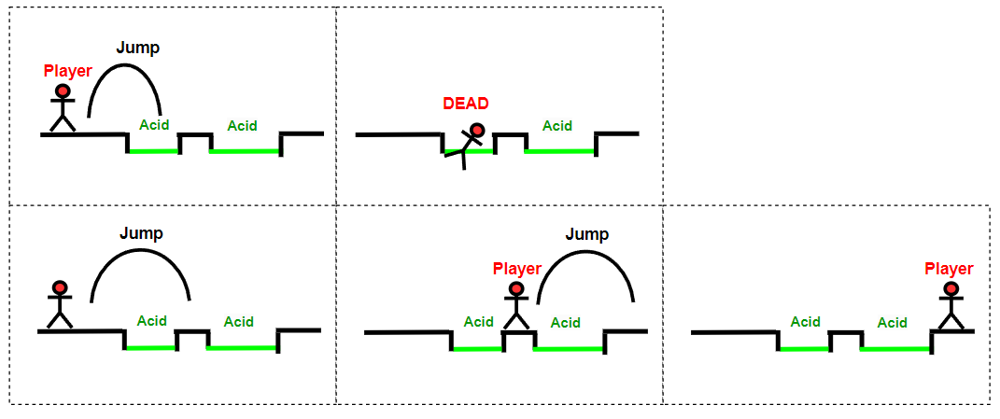

### 2.4. Health Pickups
Health Pickups are the only object within the game that can heal the player the amount of each health pack can vary, however as the game progresses the health packs will be worth less health the they were at the start.
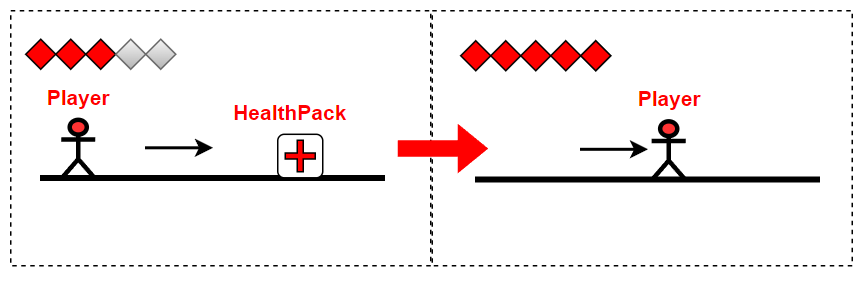

### 2.5. Chompers
Chompers are an enemy type that are much more aggressive than spitters, they actively pursue players and bite launch themselves when in range to bite the players unlike its counter part teh spitter.
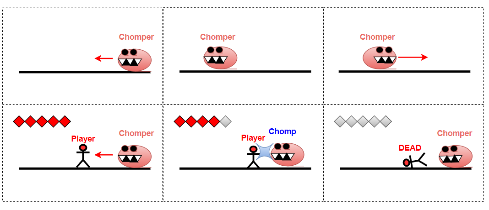

### 2.6. Weapon Pickup (Staff)
The staff is a weapon pick up that allows the players to enagage in close combat, it can also be used to bridge large jumps as it slightly moves players in the direction that they attack.
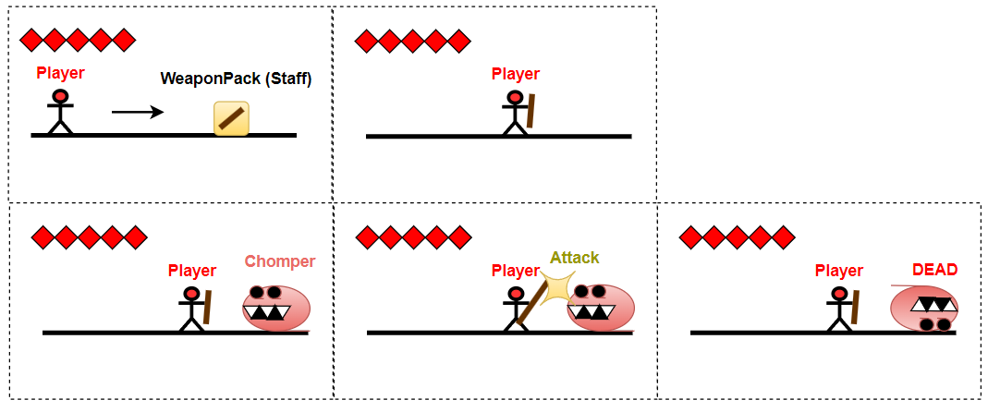

### 2.7. Keys
The keys are the main goal of the level and each of them are placed in a different section collection of the keys is tracked through the UI at the top right hand side of the screen, once all 3 keys have been collected players can now open the final door and complete the game.
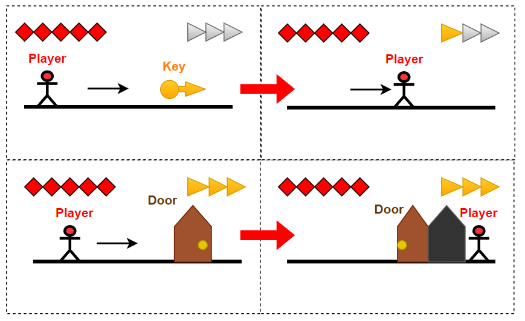

### 2.8. Moving Platforms
Moving platforms are tiles that are not snapped to the grid board and are treated as an object, they can be used to transport both players and enemies from one destination to another.
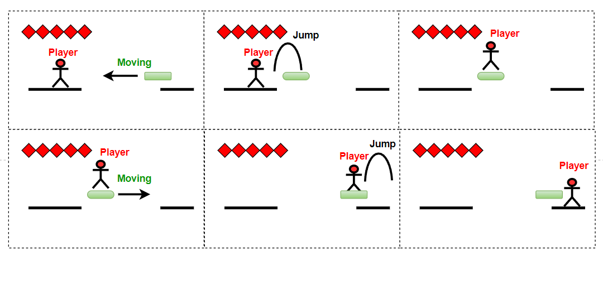

### 2.9. Spikes
Spikes are a trap object that damages and knocks the player back slightly when coming into contact unlike the acid the spikes only damage a player and do not reset them back to the last checkpoint.
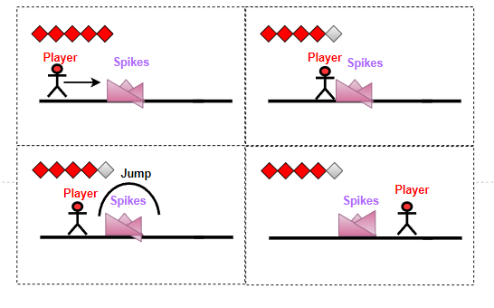

### 2.10. Spitters
Spitters are an enemy type that acts much like a sentury, when detecting a player within its range it will lock on and spit a spitball towards the player, over long distances this spit ball will start to fall as it is effected by gravity.
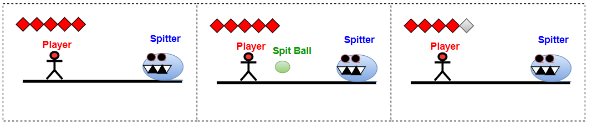

### 2.11. Weapon Pickup (Gun)
The gun is a weapon pick up is fairly staright forward, it allows a player to shoot projectiles in a straight line across the screen to damage enemies from afar, it is the best way to deal with ranged enemies such as spitters.
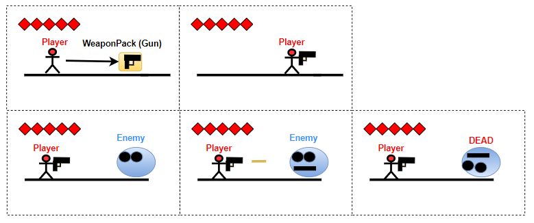

## 3. Spatiotemporal Design
A section on Spatiotemporal Design, which includes your molecule diagram and annotated level maps (one for each main section of your level). These diagrams may be made digitally or by hand, but must not be created from screenshots of your game. The annotated level maps should show the structure you intend to build, included game elements, and the path the player is expected to take through the level. Examples of these diagrams are included in the level design lectures.

No additional words are necessary for this section (any words should only be within your images/diagrams).
 
### 3.1. Molecule Diagram
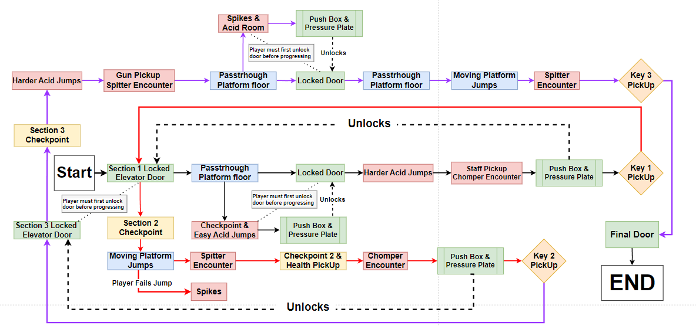
### 3.2. Level Map – Section 1
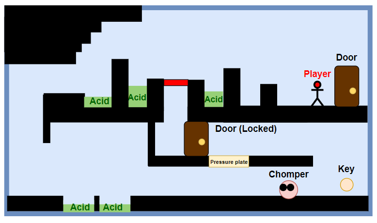
### 3.3.	Level Map – Section 2
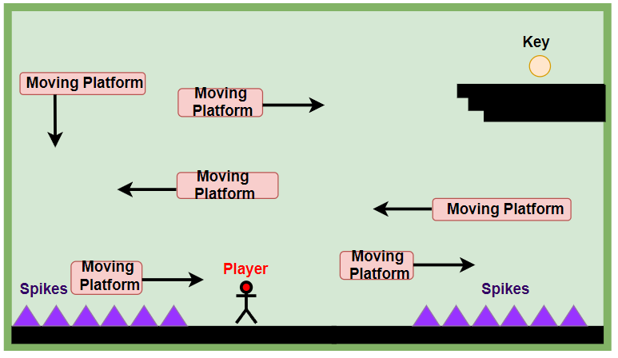
### 3.4.	Level Map – Section 3
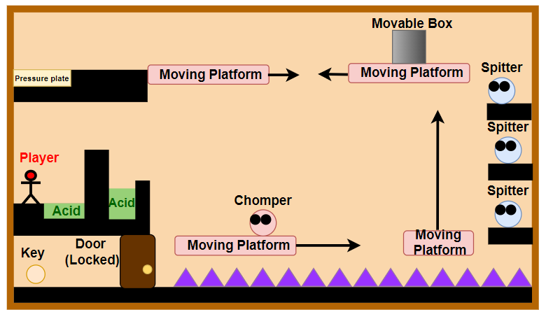
## 4. Iterative Design (~400 words)

When I began my iterative design l first created the storyboards of each feature in the form of how l originally intended to use them, using them l created basic levels designs that eventually lead to the level maps seen in section 3. After this l started to experiment with the tiles and inbuilt-feature within the project through unity, making my first commit two commits to the repository being the Section 1 design & the Acid feature.
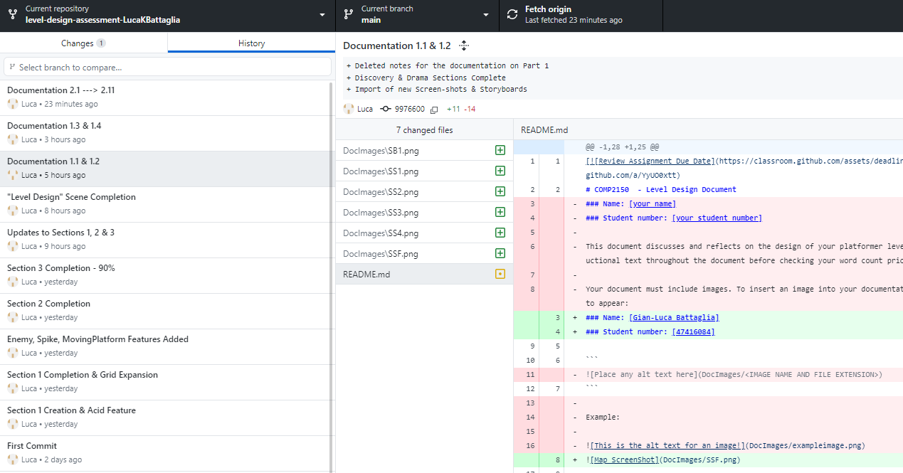

Continuing this pattern of playtesting l enlisted the help of my siblings that had not yet seen the game to gain new feedback on what they wanted to see & what they liked/disliked. This allowed for an assessment of the flow of game play & how l should fesabily incorporate future mechanics & changes to the current design layout, this would later evolve into me completing the Section 1 & then completely altering it after adding new features to make it more tutorial-like, enabling players to better acquaint themselves with dynamics & mechanics at their own pace. Following the initial prototype, subsequent play testing sessions with my siblings provided invaluable feedback, they highlighted navigational challenges and difficulties with certain jumps, particularly in sections 1 and 3 of the level. Based on this feedback, I undertook a series of adjustments to address these issues, changes included moving platform speeds, blocking off certain pathways to improve player guidance, overall gameplay difficulty.


The final iteration of the level effectively addresses earlier issues, now incorporating an enhanced player navigational and overall gameplay progression, while adjustments made to the layout have significantly improved player flow and mitigated player frustration, going from a finish time of 8.20 minutes and 1-3 deaths per playertester on average to 0 deaths & a finish time of 5.47 minutes per playertester.

Reflecting on the iterative design process I believe that through consistent playtesting & quality version control the time taken to create the game has been significantly lessened in comparison to other design process like pilot or agile, while also leaving behind a clear representation of level design  improvement between each commit. There are remaining areas for future enhancement, future iterations could focus on further optimizing player progression while also introducing additional elements such as: Breakable walls and teleporters from the 2D platformer kit as well as building upon the given backgrounds making the game more visually appealing.

## Generative AI Use Acknowledgement

Use the below table to indicate any Generative AI or writing assistance tools used in creating your document. Please be honest and thorough in your reporting, as this will allow us to give you the marks you have earnt. Place any drafts or other evidence inside this repository. This form and related evidence do not count to your word count.
An example has been included. Please replace this with any actual tools, and add more as necessary.


### Tool Used: ChatGPT
**Nature of Use** Finding relevant design theory.

**Evidence Attached?** Screenshot of ChatGPT conversation included in the folder "GenAI" in this repo.

**Additional Notes:** I used ChatGPT to try and find some more relevant design theory that I could apply to my game. After googling them, however, I found most of them were inaccurate, and some didn't exist. One theory mentioned, however, was useful, and I've incorporated it into my work.

### Tool Used: Example
**Nature of Use** Example Text

**Evidence Attached?** Example Text

**Additional Notes:** Example Text


